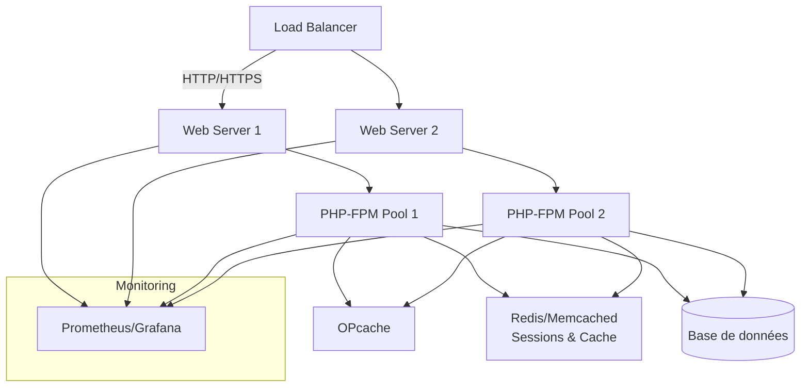

# Recommandations d’Architecture – Plugin Jeu de Rôle Multi-Utilisateur WordPress

## 1. Compatibilité et Intégration WordPress

- **Respect des standards WordPress** : Utiliser les hooks (actions/filters), l’API REST WordPress, et les conventions de développement pour garantir la compatibilité et la maintenabilité.
- **Isolation du code** : Encapsuler la logique du plugin pour éviter les conflits avec d’autres extensions (espaces de noms, préfixes, autoloading).
- **Compatibilité WooCommerce** : Prévoir des points d’intégration optionnels, mais ne pas coupler la logique cœur du jeu à WooCommerce.

## 2. Gestion de la Concurrence et des Sessions

- **Sessions utilisateurs robustes** : Utiliser les sessions PHP ou la table `wp_usermeta` pour stocker l’état de jeu, avec fallback sécurisé si cookies désactivés.
- **Isolation des parties** : Chaque session de jeu (partie) doit être isolée (ID unique, permissions strictes, séparation des données).
- **Gestion des accès concurrents** : Implémenter des verrous logiques (optimistes/pessimistes) pour éviter les conflits lors des actions simultanées (ex : modification d’état de partie).
- **Synchronisation temps réel** : Utiliser WebSocket (via un serveur Node.js externe ou service tiers) pour la diffusion instantanée des états, avec fallback AJAX/REST pour compatibilité maximale.

## 3. Performance et Scalabilité

- **Traitement asynchrone** : Déléguer les tâches lourdes (calculs, notifications, sauvegardes) à des workers ou via des hooks asynchrones (Action Scheduler, queues personnalisées).
- **Cache ciblé** : Utiliser le cache objet WordPress (`wp_cache_*`) pour les états de partie et les données fréquemment lues, avec invalidation fine.
- **Gestion des ressources serveur** : Limiter la fréquence des requêtes AJAX, monitorer l’utilisation mémoire/CPU, prévoir des quotas ou files d’attente pour les parties très actives.
- **Scalabilité horizontale** : Prévoir la possibilité de déporter la gestion temps réel (WebSocket) et le stockage d’états sur des services externes (Redis, Firebase, etc.).

## 4. Sécurité et Anti-Triche

- **Validation côté serveur** : Toutes les actions de jeu doivent être validées côté serveur, jamais uniquement côté client.
- **Authentification forte** : S’appuyer sur le système d’authentification WordPress, renforcer avec nonce et vérification de capacités utilisateur.
- **Isolation stricte des données** : Vérifier systématiquement que chaque requête AJAX/REST/WebSocket ne donne accès qu’aux données de la partie/session autorisée.
- **Détection d’anomalies** : Logger les actions suspectes, prévoir des alertes ou blocages automatiques en cas de comportements anormaux (ex : flood, triche, manipulation de requêtes).
- **Protection contre le XSS/CSRF** : Échapper toutes les sorties, utiliser les nonces WordPress pour toutes les requêtes sensibles.

## 5. Gestion des États de Partie et Notifications

- **Modélisation claire des états** : Définir un schéma d’état de partie (ex : attente, en cours, pause, terminée) et transitions autorisées.
- **Persistance fiable** : Sauvegarder l’état de chaque partie de façon atomique (transactions SQL ou équivalent), prévoir des sauvegardes régulières.
- **Notifications temps réel** : Utiliser WebSocket pour les notifications instantanées (actions, tours, messages), fallback AJAX pour les clients non compatibles.
- **Files d’attente et matchmaking** : Implémenter une file d’attente pour les joueurs en attente de partie, avec gestion des priorités et notifications d’entrée en jeu.

## 6. Expérience Utilisateur

- **Interface réactive** : Privilégier une UI dynamique (React/Vue ou JS natif) pour l’affichage des états, notifications, et interactions en temps réel.
- **Feedback utilisateur** : Afficher clairement les changements d’état, erreurs, et actions en attente.
- **Accessibilité** : Respecter les standards d’accessibilité (ARIA, navigation clavier).
- **Déconnexion/reconnexion fluide** : Permettre la reprise de session sans perte d’état en cas de déconnexion/reconnexion.

## 7. Monitoring et Observabilité

- **Logs détaillés** : Journaliser les actions clés (connexion, début/fin de partie, erreurs, tentatives de triche).
- **Tableau de bord admin** : Fournir un dashboard pour le suivi des parties en cours, des files d’attente, et des alertes de sécurité.
- **Alertes ciblées** : Mettre en place des alertes (email, Slack, etc.) en cas d’incident critique (surcharge, triche détectée, crash).

---

**Résumé visuel (Mermaid) :**

```mermaid
flowchart TD
    subgraph Utilisateur
        A[Connexion/Inscription]
        B[Interface Jeu]
    end
    subgraph Serveur WordPress
        C[Plugin RPG]
        D[Gestion Sessions & États]
        E[API REST/AJAX]
        F[WooCommerce (optionnel)]
    end
    subgraph Temps Réel
        G[Serveur WebSocket/Service tiers]
    end
    subgraph Stockage
        H[Base de données WP]
        I[Cache (Redis/Memcached)]
    end

    A --> B
    B -- AJAX/REST --> E
    B -- WebSocket --> G
    E --> C
    C --> D
    D --> H
    D --> I
    G --> D
    F -.-> C
```

---

**Points spécifiques à ce type d’application :**
- Gestion fine des états de partie et transitions.
- Notifications temps réel et fallback AJAX.
- Files d’attente et matchmaking.
- Surveillance active des ressources serveur et des comportements utilisateurs.
- Isolation stricte des sessions et des données de partie.
- Monitoring et dashboard admin pour le suivi opérationnel.

---

L’ensemble de ces recommandations est spécifiquement adapté à un plugin de jeu de rôle multi-utilisateur sur WordPress, pour garantir performance, sécurité, scalabilité et expérience utilisateur optimale.

---

## Annexe : Résilience PHP/Serveur Multi-Utilisateur – Analyse Générale

### 1. Points forts de la configuration actuelle

#### a. Version PHP et environnement
- **PHP 8.4.6** : Version récente, meilleures performances et sécurité.
- **Linux 5.15** : Système stable, supporte bien la charge et la virtualisation.

#### b. Gestion du cache
- **OPcache activé** :
  - Améliore significativement les performances en gardant le bytecode PHP en mémoire.
  - Réduit la charge CPU lors de multiples requêtes identiques.
  - Paramètres critiques à vérifier :
    - `opcache.memory_consumption` (taille mémoire allouée)
    - `opcache.max_accelerated_files` (nombre de scripts en cache)
    - `opcache.validate_timestamps` (rafraîchissement du cache)
  - **Point fort** si bien dimensionné.

#### c. Extensions critiques
- **Extensions courantes** (pdo, mysqli, mbstring, json, etc.) : OK pour la compatibilité applicative.
- **Extensions de sécurité** (ex : sodium, openssl) : Présentes, bon point pour la robustesse.

#### d. Sécurité
- **Désactivation des fonctions dangereuses** (ex : `exec`, `shell_exec`) : À vérifier dans la config.
- **open_basedir** et **disable_functions** : Doivent être utilisés pour limiter la surface d’attaque.
- **Exécution sous utilisateur dédié** : Recommandé pour limiter l’impact d’une compromission.

#### e. Limites de ressources
- **memory_limit** : Doit être suffisant pour les scripts lourds, mais pas trop élevé pour éviter l’épuisement mémoire.
- **max_execution_time** : Protège contre les scripts bloquants.
- **max_input_vars**, **post_max_size**, **upload_max_filesize** : À ajuster selon le besoin applicatif.

---

### 2. Points faibles ou risques potentiels

#### a. Scalabilité PHP (modèle process/thread)
- **PHP-FPM** ou **mod_php** : Chaque requête = nouveau process/thread → consommation mémoire linéaire avec le nombre de connexions.
- **Limite de workers/processus** : Si trop basse, saturation rapide sous forte charge (erreurs 502/503).
- **Pas de gestion native de la persistance** (sessions, connexions DB) → dépend du backend (Redis, Memcached, etc.).

#### b. OPcache : Risques
- **Taille mémoire OPcache insuffisante** : Scripts éjectés du cache, baisse de performance.
- **validate_timestamps=1** (par défaut) : Vérifie les fichiers à chaque requête, impacte la perf sous forte charge. En prod, mettre à 0 si déploiement maîtrisé.

#### c. Extensions manquantes ou sous-optimisées
- **Absence de cache applicatif** (Redis, Memcached) : Sessions et objets PHP stockés en disque ou DB → bottleneck.
- **Pas de gestionnaire de sessions distribué** : Risque de perte de session en cas de montée en charge multi-serveur.

#### d. Sécurité
- **Exposition de phpinfo.php** : Risque majeur, fuite d’informations sensibles.
- **Paramètres par défaut** : Certains paramètres (ex : `display_errors=On`) ne doivent jamais être actifs en production.

#### e. Limites système
- **Limites OS (ulimit, open files, max children)** : Peuvent bloquer la montée en charge si non ajustées.
- **Pas de monitoring** : Absence d’outils type Prometheus, Grafana, fail2ban, etc.

---

### 3. Recommandations concrètes pour améliorer la résilience

#### a. Optimisation OPcache
- Ajuster `opcache.memory_consumption` (ex : 128-256M pour gros projets).
- `opcache.max_accelerated_files` ≥ nombre de scripts PHP.
- En prod : `opcache.validate_timestamps=0` pour éviter les checks inutiles.

#### b. Gestion des workers PHP-FPM
- Adapter `pm.max_children` selon la RAM disponible et la consommation moyenne par process PHP.
- Utiliser `pm = dynamic` ou `pm = ondemand` pour ajuster dynamiquement le nombre de workers.

#### c. Sessions et cache applicatif
- Stocker les sessions PHP dans Redis ou Memcached pour la haute disponibilité.
- Utiliser un cache applicatif pour les objets/fichiers fréquemment accédés.

#### d. Sécurité
- Supprimer tout fichier phpinfo.php ou équivalent en production.
- Désactiver `display_errors`, activer `log_errors`.
- Restreindre les fonctions critiques via `disable_functions`.
- Utiliser un utilisateur système dédié pour le service PHP.

#### e. Limites système et monitoring
- Ajuster les limites OS (`ulimit -n`, `max open files`, etc.).
- Mettre en place un monitoring (Prometheus, Grafana, alertes).
- Tester la montée en charge avec des outils comme JMeter ou Gatling.

---

### 4. Schéma Mermaid – Architecture PHP résiliente



---

### 5. Synthèse claire et exploitable

- **Points forts** : Version PHP récente, OPcache activé, extensions critiques présentes, base Linux solide.
- **Points faibles** : Risque de saturation process PHP, OPcache à dimensionner, sessions non distribuées, exposition d’informations sensibles, limites système à ajuster.
- **Recommandations** : Optimiser OPcache, dimensionner PHP-FPM, externaliser sessions/cache, renforcer la sécurité, surveiller l’infrastructure, tester la montée en charge.

L’architecture actuelle est saine pour un usage standard, mais nécessite des ajustements pour garantir la résilience sous forte charge multi-utilisateur. Les recommandations ci-dessus permettent d’anticiper les goulets d’étranglement et d’assurer la continuité de service.